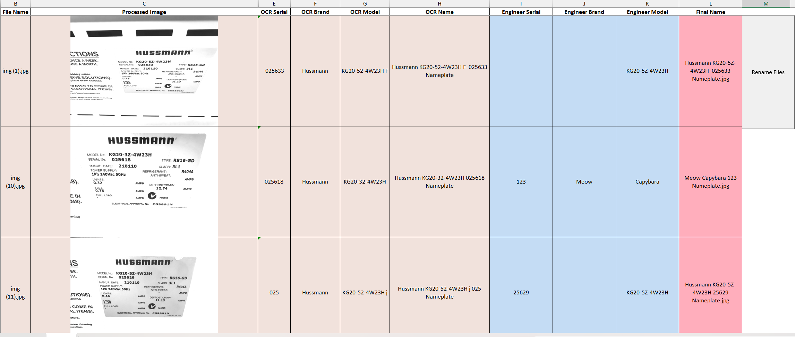

# Image Processing Project

Aka RDC Nameplate Image Processor Tool (not really good at names).

Purpose of tool is to streamline documenting of RDC nameplate equipment for Business Appliance (Deemed) ESC projects.

Tool makes use of OCR to help with identifying equipment brand name, serial numbers and model numbers whilst allowing Engineer to confirm and change details as required.

## Breakdown of Project

**test.py:** 

Script that is converted into an exe and does all the processing and excel output.

***.ipynb:**

For experimenting and testing.

## Examples

**The output excel file generation by test.py:**

## To Do

* [ ]

## Required Libraries

* pytesseract
* cv2
* os
* pandas
* xlsxwriter
* matplotlib
* numpy

### Additional Installation Instructions

Pytesseract requires the installation of additional binary files.

Can be downloaded from:

- Pytesseract: [https://github.com/tesseract-ocr/tesseract](https://github.com/tesseract-ocr/tesseract)
